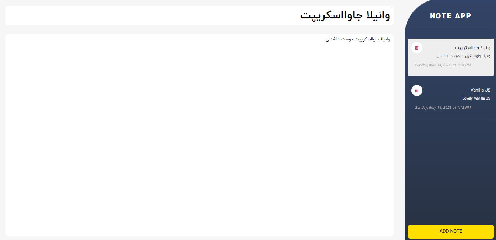

# Note App Project 📔

## [App Online Link](https://note-oop-app.netlify.app/)

## App Demo

---

## Description

This is a Note Taking App where you can Write your Personal and Business Notes.
In this Project you can add Notes, Delete any Notes you don't want and even Edit them.
Also, to Find the Note you want, Drag and Drop to Scroll between them and Select a Note.

This Modular Web App is Developed in Object-Oriented Programming Style (OOP)

## Features

- Add Note
- Edit Note
- Delete Note
- Save Notes in Local Storage
- Scroll on the list of notes by drag and drop and select a note
- When you Delete the First Note from Above, the Next Note is Automatically Selected and Styled, and When you Delete any Note (Except the First Note), the Previous Note is Automatically Selected and Styled.

## Tips 📌

- fully responsive for mobile, tablet, laptop and desktop

## Web Development Technologies

- HTML5 (Semantic HTML)
- Pure CSS3 (FlexBox)
- Vanilla JavaScript

## Contact Me

 

